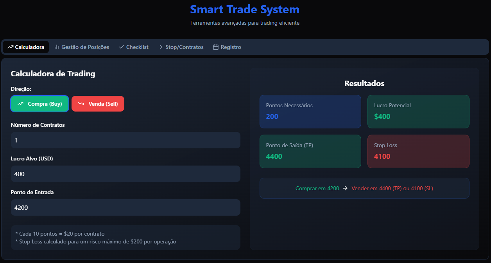
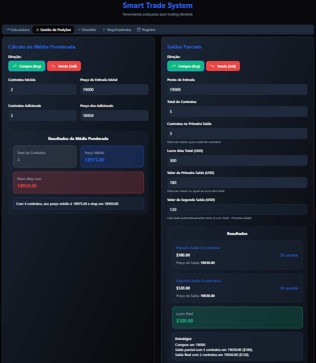
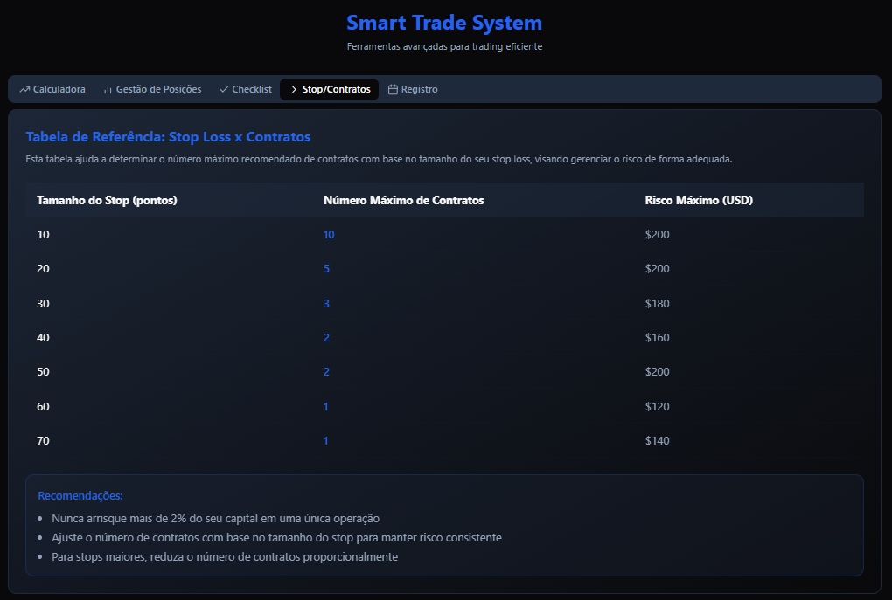
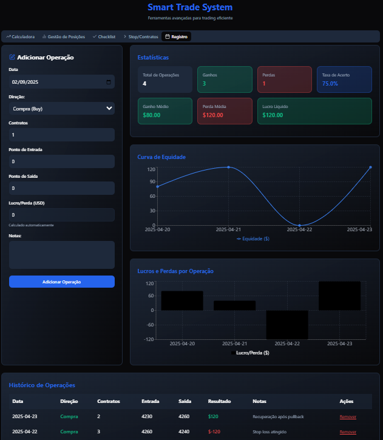

# Smart Trade System

Plataforma interativa para traders de índice futuro (NASDAQ-100), desenvolvida para auxiliar no **gerenciamento de risco**, **definição de estratégias de entrada/saída** e **controle de operações**.

👉 Acesse aqui: [Smart Trade System](https://smart-trade-system.lovable.app/)

---

## 🚀 Visão Geral

O **Smart Trade System** é uma calculadora e gerenciador de operações em day trade.
Ele permite ao trader planejar cada operação com base em **limite máximo de perda (\$200)**, metas de lucro e gestão de posições, além de manter um **histórico completo das operações**.

O sistema foi projetado para trazer **disciplina e consistência** às operações, evitando decisões impulsivas durante o pregão.

---

## 📊 Funcionalidades

### 1. **Calculadora de Trading**

* Define a direção (compra ou venda).
* Adiciona número de contratos, alvo de lucro e ponto de entrada.
* Stop Loss automático de até **\$200 por operação**.
* Retorna:

  * Quantidade de pontos para atingir o alvo.
  * Lucro potencial.
  * Ponto de saída.
  * Stop Loss em pontos.

---

### 2. **Gestão de Posições**

* Insere entradas múltiplas (contratos adicionais em diferentes preços).
* Calcula **preço médio ponderado** e novo Stop.
* Configura **saídas parciais**:

  * Lucro total desejado.
  * Lucro na primeira saída.
  * Lucro na segunda saída.
* Resultado: pontos exatos de saída para cada parcial e alvo final.

---

### 3. **Checklist Pré-Operacional**

* Lista de verificações antes de iniciar uma operação (ex.: análise de tendência, volatilidade, agenda econômica, confirmação de setup, limite de risco diário).
* Ajuda a manter a disciplina e reduzir erros emocionais.

---

### 4. **Stop/Contratos**

* Quadro de referência com a **exposição máxima permitida**.
* Reforço visual para evitar operações acima do limite de risco.

---

### 5. **Registro de Operações**

* Histórico completo das operações.
* Estatísticas consolidadas:

  * Total de operações.
  * Operações vencedoras e perdedoras.
  * Taxa de acerto.
  * Ganho médio, perda média.
  * **Lucro líquido acumulado**.

---

## 🛠️ Tecnologias Utilizadas

* **Lovable App** para deploy.
* **Python/Streamlit** para interface interativa.
* **Plotly/YFinance** (nas versões futuras, integração para gráficos e dados em tempo real).

---

## 📈 Público-Alvo

* Traders de índice futuro (ex.: Nasdaq-100).
* Quem busca consistência no gerenciamento de risco.
* Operadores que desejam centralizar cálculos, controles e estatísticas em uma única ferramenta.

---

## ▶️ Como Usar

1. Acesse [Smart Trade System](https://smart-trade-system.lovable.app/).
2. Comece na aba **Calculadora** para planejar sua operação.
3. Use a aba **Gestão de Posições** para entradas adicionais.
4. Passe pelo **Checklist** antes de confirmar qualquer trade.
5. Consulte a aba **Registro** para acompanhar o desempenho.

---

## 🔮 Próximos Passos (Roadmap)

* Integração com dados de mercado em tempo real.
* Exportação dos registros para Excel/CSV.
* Alertas automáticos de risco e atingimento de metas.
* Dashboard gráfico de desempenho.

---

## 📌 Licença

Este projeto é de uso pessoal/educacional e não constitui recomendação de investimento.
